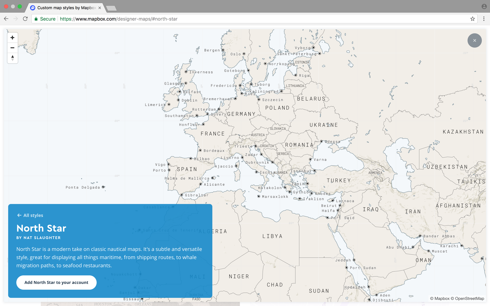

# Striking Distance: Mapping U.S. Aircraft Carrier Deployments, 2012-2018




## Carrier Data

### Sample AIS data for the ```77 week period``` from May 23, 2012 to November 14, 2013

| ATLANTIC CARRIERS | HOME PORT | AS OF | NOTES:
| ---: | :---: | :---: | :--- |
| CVN 65 USS *Enterprise* | Norfolk, VA | 5/15/2012 | Conducting maritime security operations/support missions in the U.S. Fifth Fleet Area of Responsibility (AOR) |
| CVN 69 USS *Dwight D. Eisenhower* | Norfolk, VA | 5/15/2012 | Underway in the Atlantic Ocean conducting a Composite Training Unit Exercise |
| CVN 71 USS *Theodore Roosevelt* | Norfolk, VA | 9/29/2009 | Undergoing a 3Y Refueling and Complex Overhaul (RCOH) in Newport News, VA until 4Q12 |
| CVN 75 USS *Harry S. Truman* | Norfolk, VA | 3/25/2011 | Undergoing an 11M Docking Planned Incremental Availability (DPIA) maintenance period in Newport News, VA |
| CVN 77 USS *George H.W. Bush* | Norfolk, VA | 5/15/2012 | Returned to home port |

| PACIFIC CARRIERS | HOME PORT | AS OF | NOTES:
| ---: | :---: | :---: | :--- |
| CVN 68 USS *Nimitz* | Everett, WA | 5/15/2012 | Underway in the Pacific Ocean conducting Carrier Qualifications (CQ) |
| CVN 70 USS *Carl Vinson* | San Diego, CA | 5/15/2012 | Scheduled port visit to Pearl Harbor, HI |
| CVN 72 USS *Abraham Lincoln* | Everett, WA | 5/15/2012 | Conducting maritime security operations/support missions in the U.S. Fifth Fleet Area of Responsibility (AOR) |
| CVN 73 USS *George Washington* | Yokosuka, Japan | 5/15/2012 | In home port |
| CVN 74 USS *John C. Stennis* | Kitsap-Bremerton, WA | 5/15/2012 | In home port |
| CVN 76 USS *Ronald Reagan* | San Diego, CA | 1/20/2012 | Undergoing an 11M Docking Planned Incremental Availability (DPIA) maintenance period in Kitsap-Bremerton, WA |

| BIG-DECK AMPHIBIOUS WARFARE SHIPS | HOME PORT | AS OF | NOTES:
| ---: | :---: | :---: | :--- |
| LHA 5 USS *Peleliu* | San Diego, CA | 5/15/2012 | Underway in the Pacific Ocean conducting sea qualifications |
| LHD 1 USS *Wasp* | Norfolk, VA | 5/8/2012 | In home port |
| LHD 2 USS *Essex* | San Diego, CA | 5/16/2012 | Underway in the Pacific Ocean |
| LHD 3 USS *Kearsarge* | Norfolk, VA | 5/8/2012 | In home port |
| LHD 4 USS *Boxer* | San Diego, CA | 12/14/2011 | Undergoing repairs and upgrades through 2Q12 |
| LHD 5 USS *Bataan* | Norfolk, VA | 5/15/2012 | In home port |
| LHD 6 USS *Bonhomme Richard* | Sasebo, Japan | 5/15/2012 | In home port |
| LHD 7 USS *Iwo Jima* | Norfolk, VA | 5/15/2012 | Conducting maritime security operations/support missions in the U.S. Fifth Fleet Area of Responsibility (AOR) |
| LHD 8 USS *Makin Island* | San Diego, CA | 5/15/2012 | Underway in the U.S. Seventh Fleet Area of Responsibility (AOR) |

### Sample AIS data for the ```157 week period``` from November 21, 2013 to November 24, 2016

| ATLANTIC CARRIERS | HOME PORT | AS OF | NOTES:
| ---: | :---: | :---: | :--- |
| CVN 69 USS *Dwight D. Eisenhower* | Norfolk, VA | 11/23/2016 | Supporting maritime security operations/conducting theater security cooperation efforts in the U.S. Fifth Fleet Area of Responsibility (AOR) |
| CVN 72 USS *Abraham Lincoln* | Norfolk, VA | 3/28/2013 | Undergoing a 3.5Y Refueling and Complex Overhaul (RCOH) in Newport News, VA |
| CVN 73 USS *George Washington* | Norfolk, VA | 11/23/2016 | In home port |
| CVN 75 USS *Harry S. Truman* | Norfolk, VA | 11/23/2016 | In home port |
| CVN 77 USS *George H.W. Bush* | Norfolk, VA | 11/23/2016 | In home port |

| PACIFIC CARRIERS | HOME PORT | AS OF | NOTES:
| ---: | :---: | :---: | :--- |
| CVN 68 USS *Nimitz* | Everett, WA | 11/23/2016 | Underway in the Pacific Ocean |
| CVN 70 USS *Carl Vinson* | San Diego, CA | 11/23/2016 | Returned to home port |
| CVN 71 USS *Theodore Roosevelt* | San Diego, CA | 11/23/2016 | In home port |
| CVN 74 USS *John C. Stennis* | Kitsap-Bremerton, WA | 11/23/2016 | Underway in the Pacific Ocean |
| CVN 76 USS *Ronald Reagan* | Yokosuka, Japan | 11/23/2016 | In home port |

| BIG-DECK AMPHIBIOUS WARFARE SHIPS | HOME PORT | AS OF | NOTES:
| ---: | :---: | :---: | :--- |
| LHA 6 USS *America* | San Diego, CA | 11/23/2016 | Returned to home port |
| LHD 1 USS *Wasp* | Norfolk, VA | 11/23/2016 | Supporting maritime security operations/conducting theater security cooperation efforts in the U.S. Fifth Fleet Area of Responsibility (AOR) |
| LHD 2 USS *Essex* | San Diego, CA | 11/23/2016 | In home port |
| LHD 3 USS *Kearsarge* | Norfolk, VA | 11/23/2016 | In home port |
| LHD 4 USS *Boxer* | San Diego, CA | 11/23/2016 | In home port |
| LHD 5 USS *Bataan* | Norfolk, VA | 11/23/2016 | In home port |
| LHD 6 USS *Bonhomme Richard* | Sasebo, Japan | 11/23/2016 | In home port |
| LHD 7 USS *Iwo Jima* | Mayport, FL | 11/23/2016 | Returned to home port |
| LHD 8 USS *Makin Island* | San Diego, CA | 11/23/2016 | Underway in the Pacific Ocean |

### Sample AIS data for the ```57+ week period``` from December 22, 2016 to Present

| CARRIER STRIKE GROUPS (CSGs) AT SEA | AMPHIBIOUS READ GROUPS (ARGs)/MARINE EXPEDITIONARY UNITS (MEU) AT SEA |
| ---: | :--- |
| CVN 71 USS *Theodore Roosevelt* - San Diego, CA - Supporting maritime security operations/conducting theater security cooperation efforts in the U.S. Fifth Fleet Area of Responsibility (AOR) | LHA 6 USS *America* - San Diego, CA - Underway in the U.S. Fifth Fleet Area of Responsibility (AOR) |
| | LHD 1 USS *Wasp* - Norfolk, VA - Underway in the Pacific Ocean while transiting to Sasebo, Japan, to conduct a turnover with the LHD 6 USS *Bonhomme Richard* |

| CARRIER STRIKE GROUPS (CSGs) IN HOME PORT | AMPHIBIOUS READ GROUPS (ARGs)/MARINE EXPEDITIONARY UNITS (MEU) IN HOME PORT |
| ---: | :--- |
| CVN 68 USS *Nimitz* - Everett, WA | LHD 2 USS *Essex* - San Diego, CA |
| CVN 69 USS *Dwight D. Eisenhower* - Norfolk, VA | LHD 3 USS *Kearsarge* - Norfolk, VA |
| CVN 70 USS *Carl Vinson* - San Diego, CA | LHD 4 USS *Boxer* - San Diego, CA |
| CVN 72 USS *Abraham Lincoln* - Norfolk, VA | LHD 5 USS *Bataan* - Norfolk, VA |
| CVN 73 USS *George Washington* - Norfolk, VA | LHD 6 USS *Bonhomme Richard* - Sasebo, Japan |
| CVN 74 USS *John C. Stennis* - Kitsap-Bremerton, WA | LHD 7 USS *Iwo Jima* - Mayport, FL |
| CVN 75 USS *Harry S. Truman* - Norfolk, VA | LHD 8 USS *Makin Island* - San Diego, CA |
| CVN 76 USS *Ronald Reagan* - Yokosuka, Japan | |
| CVN 77 USS *George H.W. Bush* - Norfolk, VA | |
| CVN 78 USS *Gerald R. Ford* - Norfolk, VA | |

## Key Carrier Technologies

* Catapult Assisted Take-Off But Arrested Recovery (CATOBAR) -- U.S. and France
  * Electromagnetic Aircraft Launch System (EMALS) -- U.S. and China
* Short Take-Off But Arrested Recovery (STOBAR) -- Russia, China, and India
* Short Take-Off and Vertical Landing (STOVL) -- UK, Italy, Spain, and Thailand

### Current Carrier Powers

```States whose navies currently field CATOBAR/EMALS/STOBAR/STOVL carriers; excludes helicopter carriers/amphibious assault ships```

| State | Carriers in Service | Carriers in Reserve | Carriers Under Construction |
| ---: | :---: | :---: |:--- |
| China | 2 | 0 | 1 |
| France | 1 | 0 | 0 |
| India | 1 | 0 | 1 |
| Italy | 2 | 0 | 1 |
| Russia | 1 | 0 | 1 |
| Spain | 1 | 0 | 0 |
| Thailand | 1 | 0 | 0 |
| UK | 1 | 0 | 1 |
| U.S. | 11 | 0 | 2 |

### Future Carrier Powers

```States currently lacking carriers whose navies have CATOBAR/EMALS/STOBAR/STOVL carriers currently on order and under construction```

| State | Carriers in Service | Carriers Under Construction |
| ---: | :---: | :--- |
| Turkey | 0 | 1 |

### Past Carrier Powers

```States currently lacking carriers whose navies have decomissioned all CATOBAR/EMALS/STOBAR/STOVL carriers, with no replacement vessels under construction```

| State | Decommissioned Carriers | Carriers Under Construction |
| ---: | :---: | :--- |
| Argentina | 2 | 0 |
| Australia | 3 | 0 |
| Brazil | 2 | 0 |
| Canada | 3 | 0 |

### Potential Carrier Powers

```States currently lacking carriers whose navies have planned CATOBAR/EMALS/STOBAR/STOVL carriers in the past, but cancelled construction for any reason```

| State | Planned Carriers (Never Completed) | Carriers Under Construction |
| ---: | :---: | :--- |
| Germany | 7 | 0 |
| Japan | 4 | 0 |
| Netherlands | 4 | 0 |

## Merchant Vessel Types and Cargo Flows

* Liquid Tankers/Gas Carriers/Parcel Carriers -- Oil, Refined Products/Distillates, Chemicals, Gas, LPG, LNG
* Bulkers/Combination Carriers -- Dry Bulk, Ores, Grains, Softs, Livestock, Combination Cargoes
* Containerized Ships/Cargo Carriers -- Intermodal TEUs
* Refrigerated Ships -- Fruit, Meat, Fish, Vegetables, Dairy Products, and Other Foods
* ROROs -- Automobiles/Trucks/Tractors/Roll-on-Roll-off cargo

## Diplomatic Tension/Military Escalation Data 
* Global Database of Events, Language, and Tone (GDELT)
* Integrated Conflict Early Warning System (ICEWS)

## Event Coding from the Conflict and Mediation Event Observations (CAMEO) Framework

**01: MAKE PUBLIC STATEMENT** -- source 
  010: Make statement, not specified below
  011: Decline comment
  012: Make pessimistic comment
  013: Make optimistic comment
  014: Consider policy option
  015: Acknowledge or claim responsibility
  016: Deny responsibility
  017: Engage in symbolic act
  018: Make empathetic comment
  019: Express accord

**02: APPEAL**
  020: Make an appeal or request, not specified below
  021: Appeal for material cooperation, not specified below
    0211: Appeal for economic cooperation
    0212: Appeal for military cooperation
    0213: Appeal for judicial cooperation
    0214: Appeal for intelligence
  022: Appeal for diplomatic cooperation (such as policy support)
  023: Appeal for aid, not specified below
    0231: Appeal for economic aid
    0232: Appeal for military aid
    0233: Appeal for humanitarian aid
    0234: Appeal for military protection or peacekeeping
  024: Appeal for political reform, not specified below
    0241: Appeal for change in leadership
    0242: Appeal for policy change
    0243: Appeal for rights
    0244: Appeal for change in institutions, regime
  025: Appeal to yield, not specified below
    0251: Appeal for easing of administrative sanctions
    0252: Appeal for easing of political dissent
    0253: Appeal for release of persons or property
    0254: Appeal for easing of economic sanctions, boycott, or embargo
    0255: Appeal for target to allow international involvement (non-mediation)
    0256: Appeal for de-escalation of military engagement
  026: Appeal to others to meet or negotiate
  027: Appeal to others to settle dispute
  028: Appeal to engage in or accept mediation

**03: EXPRESS INTENT TO COOPERATE**
  030: Express intent to cooperate, not specified below
  031: Express intent to engage in material cooperation, not specified below
    0311: Express intent to cooperate economically
    0312: Express intent to cooperate militarily
    0313: Express intent to cooperate on judicial matters
    0314: Express intent to cooperate on intelligence
  032: Express intent to engage in diplomatic cooperation (such as policy support)
  033: Express intent to provide material aid, not specified below
    0331: Express intent to provide economic aid
    0332: Express intent to provide military aid
    0333: Express intent to provide humanitarian aid
    0334: Express intent to provide military protection or peacekeeping
  034: Express intent to institute political reform, not specified below
    0341: Express intent to change leadership
    0342: Express intent to change policy
    0343: Express intent to provide rights
    0344: Express intent to change institutions, regime
  035: Express intent to yield, not specified below
    0351: Express intent to ease administrative sanctions
    0352: Express intent to ease popular dissent
    0353: Express intent to release persons or property
    0354: Express intent to ease economic sanctions, boycott, or embargo
    0355: Express intent to allow international involvement (non-mediation)
    0356: Express intent to de-escalate military engagement
  036: Express intent to meet or negotiate
  037: Express intent to settle dispute
  038: Express intent to accept mediation
  039: Express intent to mediate

**04: CONSULT**
  040: Consult, not specified below
  041: Discuss by telephone
  042: Make a visit
  043: Host a visit
  044: Meet at a ”third” location
  045: Mediate
  046: Engage in negotiation

**05: ENGAGE IN DIPLOMATIC COOPERATION**
  050: Engage in diplomatic cooperation, not specified below
  051: Praise or endorse
  052: Defend verbally
  053: Rally support on behalf of
  054: Grant diplomatic recognition
  055: Apologize
  056: Forgive
  057: Sign formal agreement

**06: ENGAGE IN MATERIAL COOPERATION**
  060: Engage in material cooperation, not specified below
  061: Cooperate economically
  062: Cooperate militarily
  063: Engage in judicial cooperation
  064: Share intelligence or information

**07: PROVIDE AID**
  070: Provide aid, not specified below
  071: Provide economic aid
  072: Provide military aid
  073: Provide humanitarian aid
  074: Provide military protection or peacekeeping
  075: Grant asylum

**08: YIELD**
  080: Yield, not specified below
  081: Ease administrative sanctions, not specified below
    0811: Ease restrictions on political freedoms
    0812: Ease ban on political parties or politicians
    0813: Ease curfew
    0814: Ease state of emergency or martial law
  082: Ease political dissent
  083: Accede to requests or demands for political reform, not specified below
    0831: Accede to demands for change in leadership
    0832: Accede to demands for change in policy
    0833: Accede to demands for rights
    0834: Accede to demands for change in institutions, regime
  084: Return, release, not specified below
    0841: Return, release person(s)
    0842: Return, release property
  085: Ease economic sanctions, boycott, embargo
  086: Allow international involvement, not specified below
    0861: Receive deployment of peacekeepers
    0862: Receive inspectors
    0863: Allow humanitarian access
  087: De-escalate military engagement
    0871: Declare truce, ceasefire
    0872: Ease military blockade
    0873: Demobilize armed forces
    0874: Retreat or surrender militarily

**09: INVESTIGATE**
  090: Investigate, not specified below
  091: Investigate crime, corruption
  092: Investigate human rights abuses
  093: Investigate military action
  094: Investigate war crimes

**10: DEMAND**
  100: Demand, not specified below
  101: Demand material cooperation, not specified below
    1011: Demand economic cooperation
    1012: Demand military cooperation
    1013: Demand judicial cooperation
    1014: Demand intelligence cooperation
  102: Demand diplomatic cooperation (such as policy support)
  103: Demand material aid, not specified below
    1031: Demand economic aid
    1032: Demand military aid
    1033: Demand humanitarian aid
    1034: Demand military protection or peacekeeping
  104: Demand political reform, not specified below
    1041: Demand change in leadership
    1042: Demand policy change
    1043: Demand rights
    1044: Demand change in institutions, regime
  105: Demand that target yields, not specified below
    1051: Demand easing of administrative sanctions
    1052: Demand easing of political dissent
    1053: Demand release of persons or property
    1054: Demand easing of economic sanctions, boycott, or embargo
    1055: Demand that target allows international involvement (non-mediation)
    1056: Demand de-escalation of military engagement
  106: Demand meeting, negotiation
  107: Demand settling of dispute
  108: Demand mediation

**11: DISAPPROVE**
  110: Disapprove, not specified below
  111: Criticize or denounce
  112: Accuse, not specified below
    1121: Accuse of crime, corruption
    1122: Accuse of human rights abuses
    1123: Accuse of aggression
    1124: Accuse of war crimes
    1125: Accuse of espionage, treason
  113: Rally opposition against
  114: Complain officially
  115: Bring lawsuit against
  116: Find guilty or liable (legally)

**12: REJECT**
  120: Reject, not specified below
  121: Reject material cooperation
    1211: Reject economic cooperation
    1212: Reject military cooperation
  122: Reject request or demand for material aid, not specified below
    1221: Reject request for economic aid
    1222: Reject request for military aid
    1223: Reject request for humanitarian aid
    1224: Reject request for military protection or peacekeeping
  123: Reject request or demand for political reform, not specified below
    1231: Reject request for change in leadership
    1232: Reject request for policy change
    1233: Reject request for rights
    1234: Reject request for change in institutions, regime
  124: Refuse to yield, not specified below
    1241: Refuse to ease administrative sanctions
    1242: Refuse to ease popular dissent
    1243: Refuse to release persons or property
    1244: Refuse to ease economic sanctions, boycott, or embargo
    1245: Refuse to allow international involvement (non mediation)
    1246: Refuse to de-escalate military engagement
  125: Reject proposal to meet, discuss, or negotiate
  126: Reject mediation
  127: Reject plan, agreement to settle dispute
  128: Defy norms, law
  129: Veto

**13: THREATEN**
  130: Threaten, not specified below
  131: Threaten non-force, not specified below
    1311: Threaten to reduce or stop aid
    1312: Threaten with sanctions, boycott, embargo
    1313: Threaten to reduce or break relations
  132: Threaten with administrative sanctions, not specified below
    1321: Threaten with restrictions on political freedoms
    1322: Threaten to ban political parties or politicians
    1323: Threaten to impose curfew
    1324: Threaten to impose state of emergency or martial law
  133: Threaten with political dissent, protest
  134: Threaten to halt negotiations
  135: Threaten to halt mediation
  136: Threaten to halt international involvement (non-mediation)
  137: Threaten with repression
  138: Threaten with military force, not specified below
    1381: Threaten blockade
    1382: Threaten occupation
    1383: Threaten unconventional violence
    1384: Threaten conventional attack
    1385: Threaten attack with WMD
  139: Give ultimatum

**14: PROTEST**
  140: Engage in political dissent, not specified below
  141: Demonstrate or rally, not specified below
    1411: Demonstrate for leadership change
    1412: Demonstrate for policy change
    1413: Demonstrate for rights
    1414: Demonstrate for change in institutions, regime
  142: Conduct hunger strike, not specified below
    1421: Conduct hunger strike for leadership change
    1422: Conduct hunger strike for policy change
    1423: Conduct hunger strike for rights
    1424: Conduct hunger strike for change in institutions, regime
  143: Conduct strike or boycott, not specified below
    1431: Conduct strike or boycott for leadership change
    1432: Conduct strike or boycott for policy change
    1433: Conduct strike or boycott for rights
    1434: Conduct strike or boycott for change in institutions, regime
  144: Obstruct passage, block, not specified below
    1441: Obstruct passage to demand leadership change
    1442: Obstruct passage to demand policy change
    1443: Obstruct passage to demand rights
    1444: Obstruct passage to demand change in institutions, regime
  145: Protest violently, riot, not specified below
    1451: Engage in violent protest for leadership change
    1452: Engage in violent protest for policy change
    1453: Engage in violent protest for rights
    1454: Engage in violent protest for change in institutions, regime

**15: EXHIBIT FORCE POSTURE**
  150: Demonstrate military or police power, not specified below
  151: Increase police alert status
  152: Increase military alert status
  153: Mobilize or increase police power
  154: Mobilize or increase armed forces
  155: Mobilize or increase cyber-forces

**16: REDUCE RELATIONS**
  160: Reduce relations, not specified below
  161: Reduce or break diplomatic relations
  162: Reduce or stop material aid, not specified below
    1621: Reduce or stop economic assistance
    1622: Reduce or stop military assistance
    1623: Reduce or stop humanitarian assistance
  163: Impose embargo, boycott, or sanctions
  164: Halt negotiations
  165: Halt mediation
  166: Expel or withdraw, not specified below
    1661: Expel or withdraw peacekeepers
    1662: Expel or withdraw inspectors, observers
    1663: Expel or withdraw aid agencies

**17: COERCE**
  170: Coerce, not specified below
  171: Seize or damage property, not specified below
    1711: Confiscate property
    1712: Destroy property
  172: Impose administrative sanctions, not specified below
    1721: Impose restrictions on political freedoms
    1722: Ban political parties or politicians
    1723: Impose curfew
    1724: Impose state of emergency or martial law
  173: Arrest, detain, or charge with legal action
  174: Expel or deport individuals
  175: Use tactics of violent repression
  176: Attack cybernetically

**18: ASSAULT**
  180: Use unconventional violence, not specified below
  181: Abduct, hijack, or take hostage
  182: Physically assault, not specified below
    1821: Sexually assault
    1822: Torture
    1823: Kill by physical assault
  183: Conduct suicide, car, or other non-military bombing, not specified below
    1831: Carry out suicide bombing
    1832: Carry out vehicular bombing
    1833: Carry out roadside bombing
    1834: Carry out location bombing
  184: Use as human shield
  185: Attempt to assassinate
  186: Assassinate

**19: FIGHT**
  190: Use conventional military force, not specified below
  191: Impose blockade, restrict movement
  192: Occupy territory
  193: Fight with small arms and light weapons
  194: Fight with artillery and tanks
  195: Employ aerial weapons, not specified below
    1951: Employ precision-guided aerial munitions
    1952: Employ remotely piloted aerial munitions
  196: Violate ceasefire

**20: USE UNCONVENTIONAL MASS VIOLENCE**
  200: Use unconventional mass violence, not specified below
  201: Engage in mass expulsion
  202: Engage in mass killings
  203: Engage in ethnic cleansing
  204: Use weapons of mass destruction, not specified below
    2041: Use chemical, biological, or radiological weapons
    2042: Detonate nuclear weapons

## Literature Review

Elleman, Bruce A., and Sarah C. M. Paine. *Naval Blockades and Seapower: Strategies and Counter-Strategies, 1805-2005.* London: Routledge, 2006. ```(annotation goes here)```

Friedman, Norman. *Seapower as Strategy: Navies and National Interests.* Annapolis, MD: Naval Institute Press, 2001. ```(annotation goes here)```

Haskew, Michael E. *Aircraft Carriers: The Illustrated History of the World's Most Important Warships.* Minneapolis, MN: Zenith Press, 2016. ```(annotation goes here)```

McBride, William M. *Technological change and the United States Navy, 1865-1945.* Baltimore, MD: Johns Hopkins University Press, 2000. ```(annotation goes here)```

Slater, David, and Peter James Taylor. *The American Century: Consensus and Coercion in the Projection of American Power.* Oxford: Blackwell, 1999. ```(annotation goes here)```

Stavridis, James. *Sea Power: The History and Geopolitics of the World's Oceans.* New York: Penguin Press, 2017. ```(annotation goes here)```

Till, Geoffrey. *Seapower: A Guide For the Twenty-First Century.* Hoboken, NJ: Taylor & Francis, 2009. ```(annotation goes here)```
